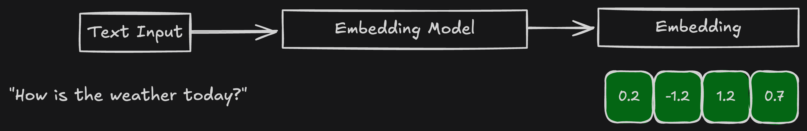

---
search:
  exclude: true
---
# Embeddings

# Table of Contents

- [What is an embedding?](#what-is-an-embedding)
- [Different Types of Embeddings](#different-types-of-embeddings)
    - [Dense Embeddings](#dense-embeddings)
    - [Sparse Embeddings](#sparse-embeddings)
- [When to use dense embeddings vs. sparse embeddings](#when-to-use-dense-embeddings-vs-sparse-embeddings)

## What is an embedding?

  

An embedding is a numerical representation of data—such as text, images, or audio—expressed as a vector of floating-point numbers (i.e. list of numbers). These vectors encode semantic meaning, allowing machines to process and compare data efficiently.

For instance, the figure above shows the process of transforming a sentence like "How is the weather today?" into a embedding. Words and phrases with similar meanings will have embeddings that are close to each other in this high-dimensional space, enabling mathematical operations to measure similarity, search relevance, and clustering.

This transformation helps bridge the gap between human language and machine understanding, making embeddings a core component in search engines, recommendation systems, and AI-driven applications.

## Different Types of Embeddings

Embeddings can be broadly categorized into two types:

- Dense embeddings – Compact, continuous vector representations that capture semantic meaning.
- Sparse embeddings – High-dimensional vectors with mostly zero values, emphasizing exact matches.

Each type is suited for different tasks in information retrieval and machine learning.

## Dense Embeddings

Dense embeddings represent data as fixed-length vectors where each dimension contributes meaningful information. These embeddings are widely used in modern AI systems because they capture nuanced relationships between words, sentences, or concepts.

### Key Characteristics

- Fixed-size vectors (e.g., 768 or 1024 dimensions).
- Most dimensions contain non-zero values.
- Capture semantic relationships effectively.

## Sparse Embeddings

Sparse embeddings are high-dimensional vectors with mostly zero values, emphasizing exact matches to keywords. They are characterized by:

### Key Characteristics

- High-dimensional vectors (e.g., 1024 dimensions).
- Most dimensions are zero.
- Focus on keyword matching.

## When to use dense embeddings vs. sparse embeddings

